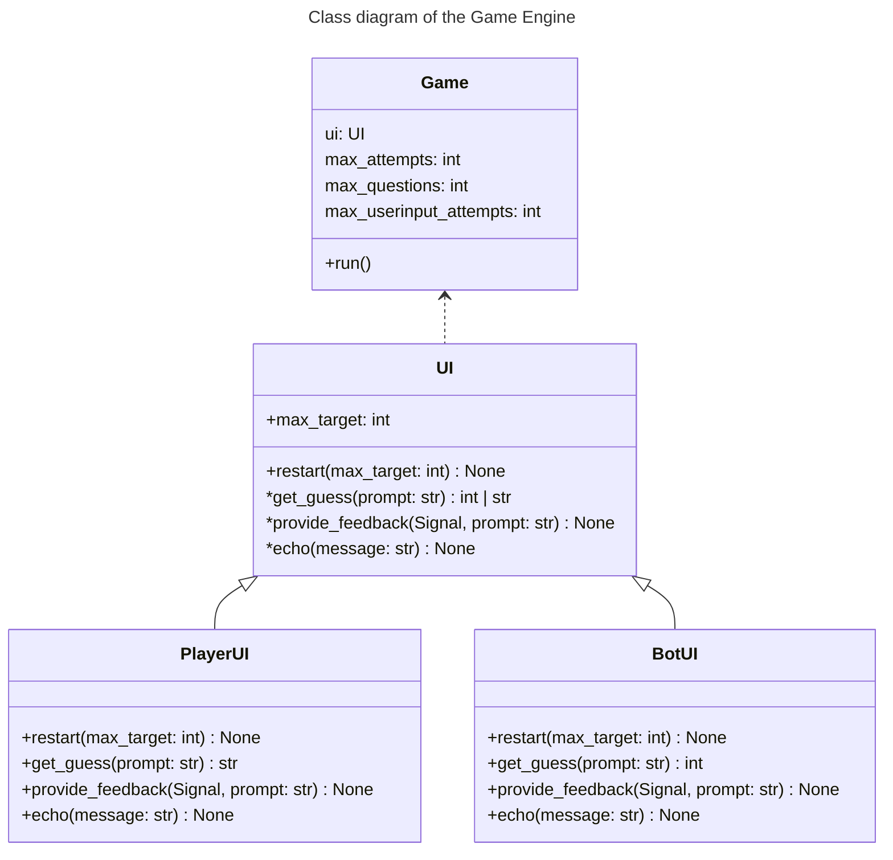
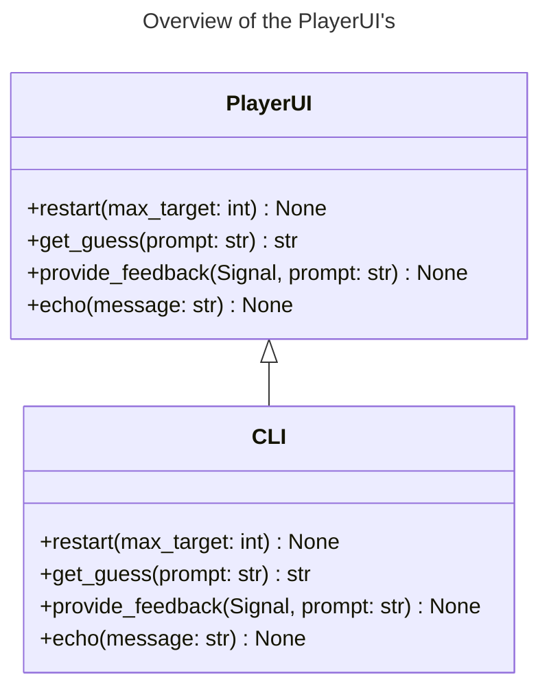
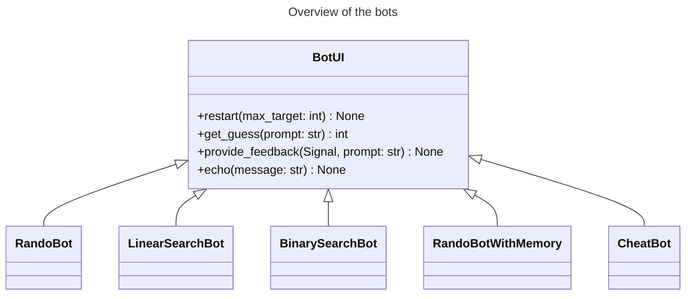

# The Number Game

This is a small game engine for a simple game where one has to guess a number between 1 and a large number like 1000. The purpose is mostly to show off my Python skills.
- ⚙️ Object-oriented programming — see [How it is built?](#how-it-is-built)
- 🛡️ Testing using pytest.
- 🤖 Automation — see [The bots](#the-bots)
- 📊 Data and mathematical analysis — see [Performance analysis](PerformanceAnalysis.ipynb)

I built the game engine using Python objects and tested it using the `pytest` framework. In addition, everything is typed, and `flake8`, `mypy`, and `complexipy` have been used to comply with the [PEP 8 style guide](https://peps.python.org/pep-0008/).

I then tested the performance of different guessing strategies by implementing them as `Bots`. Each strategy has been analysed mathematically and experimentally. For more details, please see the document [Performance analysis](PerformanceAnalysis.ipynb).

## Table of Contents

- [The Number Game](#the-number-game)
  - [Table of Contents](#table-of-contents)
  - [How it is built?](#how-it-is-built)
    - [Overview](#overview)
    - [The Player UI](#the-player-ui)
    - [The bots](#the-bots)
  - [How to install](#how-to-install)
    - [Prerequisites](#prerequisites)
    - [Start the game](#start-the-game)
    - [Testing](#testing)

## How it is built?

### Overview

The game engine is fundamentally built around the `Game` class. This class takes a user interface `UI` on construction, which is an adapter between a player and the game. This user interface is an abstract class that defines four abstract methods:
- `restart: (maximum_target: int) -> None` which resets all internal parameters in the `UI` before a game and provides the player with the maximum target value.
- `get_guess: (prompt: str) -> int | str` which asks the player for a guess as either a string or an integer.
- `provide_feedback: (Signal, prompt: str) -> None` which sends the player a feedback signal. These signals include `GUESS_TOO_LOW`, `GUESS_TOO_HIGH`, and `CORRECT_GUESS`, in addition to other technical signals.
- `echo: (message: str) -> None` which prompts a message to the user.

These methods are used by the game to communicate between the player and the game engine. Rendering, communicating with the user, etc., is handled by the implementation of `UI` subclasses.

There are two general types of `UI` subclasses:
- `PlayerUI` — defines an interface that human players can use.
- `BotUI` — defines an interface that bots can use.

From the game's point of view, the two classes are equivalent.

### The Player UI



At the moment, there is only a single type of `PlayerUI` being the command-line interface `CLI`. It implements `provide_feedback` and `echo` by simply printing to the consol using `print` and gets user input in `get_guess` via `input`.

Later, I might add a Graphical User Interface `GUI`, but that might require a re-factoring into `async` functions.


### The bots


There are currently five types of bots in the project. These are:
- 🎲 `RandoBot`: Not the smartest bot in the world. It simply makes a guess from the available numbers. It has no memory, so it usually guesses the same number multiple times.
- 🧠 `RandoBotWithMemory`: Guesses a random number but remembers what it has guessed before.
- 📏 `LinearSearchBot`: Starts from 1 and guesses all numbers in sequence until it guesses correctly.
- 🪚 `BinarySearchBot`: Uses a binary search strategy to guess the number in very few guesses.
- 😏 `CheatBot`: Always guesses correctly. It uses a loophole in the code, which I left in for fun.

If you are curious, you can read the performance analysis of the bots [here](PerformanceAnalysis.ipynb).

## How to install

### Prerequisites

- Python 3.12 or newer
- Git

Clone the repository and move into the project directory.

```powershell
git clone "https://github.com/EmilCoding/NumberGame"
cd NumberGame
```

Create and activate a virtual environment. In PowerShell, run:

```powershell
python -m venv .venv
.\.venv\Scripts\Activate.ps1
```

If PowerShell blocks the activation script, use Command Prompt instead:

```bat
.venv\Scripts\activate.bat
```

Install the dependencies and the package in editable mode:

```powershell
python -m pip install --upgrade pip
python -m pip install -r requirements.txt
python -m pip install --editable .
```

### Start the game

```powershell
python -m numbergame
```

### Testing

The project can be automatically tested by running pytest in the terminal:
```powershell
pytest
```

In addition, typing inconsistencies can be checked with `mypy`:
```powershell
mypy .\src\
```

Also, styling inconsistencies can be checked with `flake8`:
```powershell
flake8
```

If you want to go the extra mile, `complexipy` can be used to check the complexity of each function:
```powershell
complexipy .\src\
```
